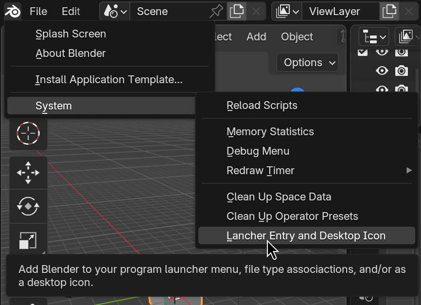
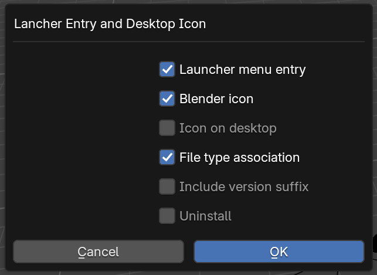

# Blender Desktop Integration

Add-on that can install or uninstall a launcher menu entry, Desktop icon, and
file type associations for the currently running Blender. This is handy if you
just unzipped Blender from a downloaded archive, but still want these things
enabled.

Supported platforms:

* [x] Linux with installed XDG tools
* [x] Windows **only tested via Wine on Linux!**
* [ ] macOS

Pull requests for Windows and macOS support are welcome.

**Note:** On Linux you might need to restart your desktop environment to actually
display the correct icon for the created shortcuts or file associations.
